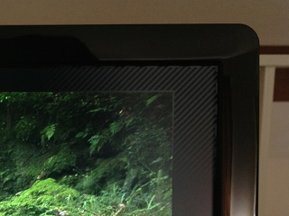
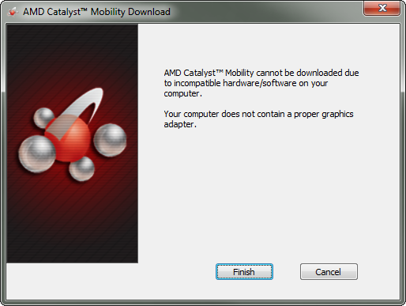

Note: this post involves replacing default drivers with new, potentially-unsupported ones. Use caution and keep backups of your original drivers just in case.

I recently bought a <a href="http://www.bestbuy.com/site/Rocketfish%26%23153%3B+-+Mini+Display+Port-to-HDMI+Adapter/2343706.p?id=1218321954502&amp;skuId=2343706&amp;st=hdmi%20rocketfish&amp;cp=1&amp;lp=12">RocketFish mini-DisplayPort-to-HDMI adapter</a> to connect my work machine, a late-2011-model 15" MacBook Pro, to my television (when I'm in my living room) and my Dell monitor (when I'm in my office). I chose the HDMI adapter over one for DVI because I can run the signal through my <a href="http://en.wikipedia.org/wiki/AV_receiver">AVR</a> for the TV and it's considerably easier to plug in an HDMI cable than a DVI one.

My potential enjoyment turned to frustration, however, when I hooked up the Mac and saw this (the banding represents the screen area that is not used by the content being shown):

Apparently, AMD--the manufacturer of the video card my Mac contains--thinks everyone is using HDMI cables with CRT screens, and defaults to a generous amount of <a href="http://en.wikipedia.org/wiki/Underscan">underscanning</a>. Consequently, everything displayed on this monitor is "squished", making crisp text look blurry. Googling for this problem turned up a <a href="http://en.community.dell.com/support-forums/peripherals/f/3529/t/19445467.aspx">sorta-but-not-quite-helpful blog post</a> from Dell:

<blockquote>* Open the ATI Catalyst Control Center 
  * Under DTV (HDMI) 3 Scaling Options or at the bottom left hand corner there is a smaller monitor where you open the configure option 
  * Select 0% Overscan 
  * Click Apply
</blockquote>

I now have some glimmer of hope that my problem can be solved (at least it's acknowledged by somebody else), but my Mac is using the Boot Camp drivers for the AMD graphics card, so the "Catalyst Control Center" mentioned in the comment isn't available. No problem: I'll just go download it from AMD's site.

Rats. Seems my video card (from all appearances, a standard Radeon 6750M) isn't supported by AMD's drivers. Having encountered this particular pain on nVidia-equipped laptops of yore, I hit some forums to look for alternatives. A succinct poster by the name of "superericla" <a href="http://forums.macrumors.com/showpost.php?p=13292436&amp;postcount=3">provides some links to Catalyst drivers</a> that aren't preceeded by a "verification of proper hardware" step:

* <a href="http://www2.ati.com/DRIVERS/mobile/11-6_mobility_vista_win7_64_dd_ccc_ocl.exe">AMD Catalyst drivers for Mobility Radeon</a> (&#92;*.exe, 86.8 MB)</li>

Installing these drivers was a painless, but confusing, process. In short: be patient. Much time was devoted to staring at a blank screen after launching the installer hoping something would happen, then staring again after the installation completed waiting for the control panel to appear. After the application finally obliged me, the process for disabling the annoying default underscan was quite simple:

1. Choose the "Desktops and Displays" category.
1. Scroll to "My Digital Flat-Panels" and click "Scaling Options (Digital Flat-Panel)".
1. Drag the slider to 0%. On my setup, the un-scaling happened in real-time.
1. Enjoy your new screen real-estate and non-blurred content!

Overall, I'm pleased how easy it was to overcome this particular problem. What experiences have you had? Found an alternate solution or better drivers? Decided to use a DVI adapter instead? Let me know in the comments!

