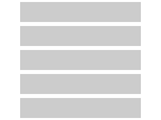
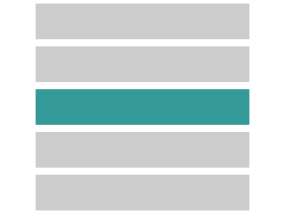
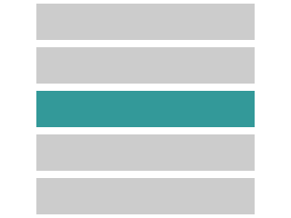
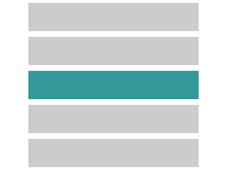
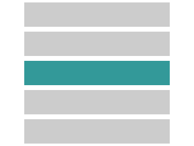

[Rachel Nabors](http://rachelnabors.com/) predicts 2015 will be "a year in motion for the web", and it's easy to see why: more and more sites are adding motion to communicate their designs, and the abundance of [animation libraries](http://julian.com/research/velocity/) (not to mention progressively greater support for [CSS transitions](http://caniuse.com/#feat=css-transitions)) makes it easier than ever to bring motion to your apps.

Like the rounded corner trend of old, however, it's easy to jump on this particular bandwagon with reckless abandon, adding every conceivable animation without truly understanding _why_. In this post, we'll look at a few common web animations, and how they support—rather than supplant—a design's intent.

## The Appear

Admittedly, having an element simply _appear_ on a page isn't truly an "animation", but I feel it's important to list for two reasons: much like every app and site has a "design" even if it has no "designer", instantly showing an element still qualifies as a transition between two states in your app, even if it's not in motion _per se_. And, before the days of JavaScript libraries and CSS animations, it was the only "transition" available. Though The Appear may not stand as proudly as its more "motion-ey" cousins, it's important to remember that we didn't always have such refined tools at our disposal.

## The Fade

One of the first animations I began using in my designs was the humble Fade. Simply adjusting the opacity of an element over time removes much of the jarring nature of The Appear, and adds an element of subtlety wherever it's used.

Unfortunately, using The Fade sometimes requires rearranging elements on the page instantly _before_ a new element can fade in, leading to similarly jarring results as The Appear.

## The Unfold

The Unfold seems to follow The Fade quite closely in popularity, but, for me, it's one of the first truly useful transitions I used. While The Fade uses opacity for its transition—an interaction rarely, if ever, seen in the physical realm—The Unfold relies purely on movement, and evokes a sense of opening a door or extracting a letter from an envelope. Revealing content in this way reinforces the sense that the newly-shown information was there all along, just waiting to be freed from its `overflow: hidden` prison.

## The Slide

While The Appear, The Fade, and The Unfold work well for _introducing_ new content, you'll sometimes need a way to animate the _removal_ of something. The Slide is my go-to solution, as both provides visual interest and supports "removal" metaphor...in fact, it rather reminds me of sweeping papers off a messy desk.

An inelegant follow-up to The Slide is to instantly—and jarringly—delete the space the recently-removed element once occupied, but pair The Slide with The Fold (The Unfold's helpful cousin), and your users will never be left wondering what happened to their nicely-stacked lists.

## The Tint

Sometimes motion isn't the best way of expressing change. Maybe a green element changes to red to indicate that a server is down, or a toggle switch changes from light to dark to signify it was just selected. In both cases, we're not relying on movement to indicate change, but, rather, other appearance characteristics: I call this The Tint.

This kind of inline change can be very impactful, especially when numerous items have their statuses updated in real-time, but can even help in very subtle ways, as with a button's "hover" state.

Beware, however, that if your transitions are _too_ subtle, many users may not notice them. Even seemingly-obvious changes (like a dramatic color shift) may be meaningless to users with difficulty seeing [small changes in contrast](http://www.w3.org/TR/UNDERSTANDING-WCAG20/visual-audio-contrast-contrast.html).

## Runners-Up

Two more animations that have gained a great deal of popularity recently are The Flip and The Shake. Though I'm unsure of the exact origin of either of these transitions, I remember first seeing them in native iOS apps.

I typically find The Flip hanging around [card-based UIs](http://semantic-ui.com/views/card.html) (cards...card _flips_...makes sense) to hide less frequently–viewed details without having to  break the context of whatever content they were viewing. This animation can be very helpful (or, if you're building an [online trading card game](http://neonmob.com/), downright _essential_), provided it's obvious enough to people that certain elements can be interacted with in this way.

Anyone who fat-fingers their OS X password is undoubtedly familiar with The Shake. One of the most deliciously-simple animations I've ever seen, The Shake is the perfect response to incorrectly input data. You needn't move your eyes to see that something happened (yet it's obvious something _did_), and the gesture so closely represents what many of us do when frustrated: give our phones, monitors, or produce a good jiggle.

The next time you find yourself about to implement some carefully thought-out animation, think about the humble beginnings of what promises to be the Year in Motion for the Web. We're just getting started bringing some amazing transitions to a historically-static medium, and the future looks more animated than ever before.
