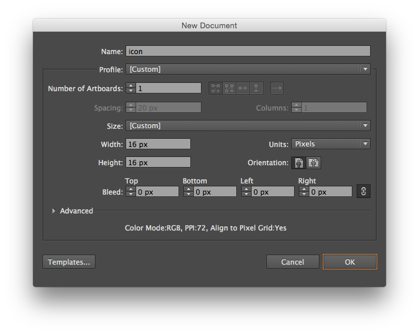
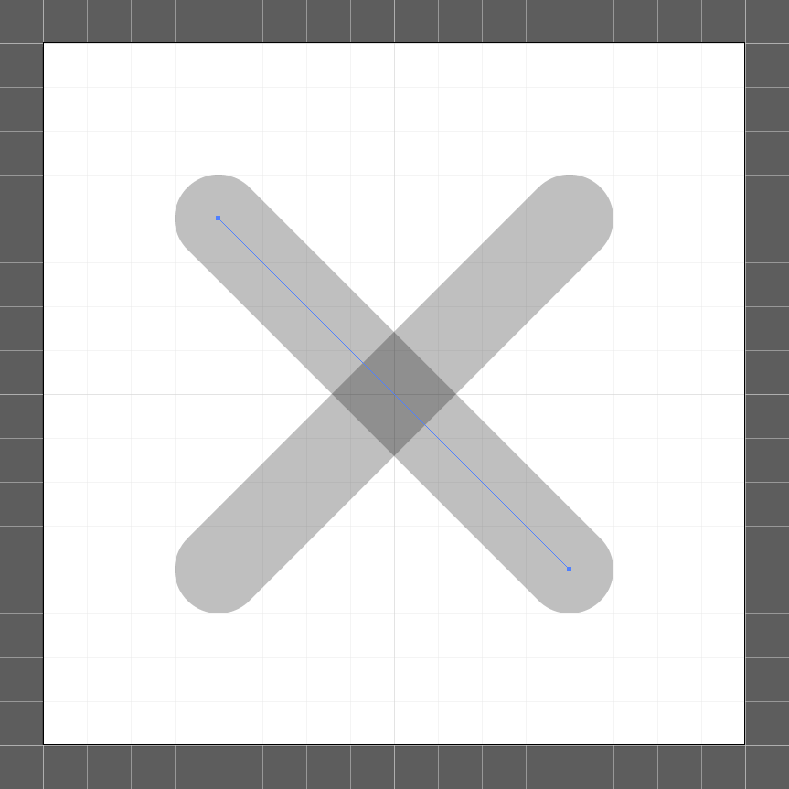
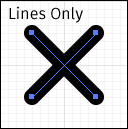
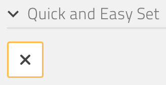

Creating icon fonts is one of my favorite things to do these days. With all the great browser design and development tools available, I'm using my pure design skills less and less; creating icons is one of the few times when I can sit down and do some solid vector-pushing.

If you're unfamiliar with the concept, icon fonts are a way of symbols in your web apps without requiring images. They're contained in a single typeface file (which means they only cost a single HTTP request), vector (so they're infinitely scalable), and, since it's still technically text, can be styled with CSS. A wide variety of icon fonts are available for use (many of them free), but some designs need a custom touch. In this post, you'll see just how easy it is to make your own icons with some great tools.

## What you'll need

The only hard requirements you'll need for this exercise are a) a vector graphics editor that can export to SVG (I'll be using [Adobe Illustrator](https://www.adobe.com/products/illustrator.html)) and b) and internet connection (one of the tools is online). Naturally, it helps to have some experience with the graphics editor you choose, but if you know how to draw lines and basic shapes, you'll be just fine.

## Making the icons

To start, we'll create a new document in Illustrator. Illustrator supports multiple ["artboards"](https://helpx.adobe.com/illustrator/how-to/work-with-artboards.html) in one document, so we can make each one the exact size of our finished icons and keep them all in one file. For this example, we'll use icons that are 16 pixels square, but you could choose any size that fits your design (though I generally stick to sizes in multiples of 8 pixels since they're easier for me to design).

Next, create the icon. Illustrator has a [myriad of tools](https://helpx.adobe.com/illustrator/using/drawing-pen-pencil-or-flare.html) available for this, but I find myself using the Pen and Line Segment tools most often. The most important thing to keep in mind at this point is to stick to whole values for sizes and positions; putting a half-pixel-thick line in-between pixels is a one-way ticket to Blursville. In Illustrator, you can check the potential blurriness of an icon by turning on Pixel Preview (View > Pixel Preview) and zooming in. I generally use a one-pixel grid while designing to make sure everything lines up _just so_, and check with Pixel Preview frequently.

For this example, we'll create a simple "delete" icon. I used perpendicular lines to form an 'x', and made each one two pixels thick. Rounded caps may not add much visual interest for some screens, but if any of your users have high-density displays, they'll appreciate the extra level of detail. (Note: in this image, I've reduced the opacity of the lines so you can see how the anchor points align perfectly with the pixel grid.)

As I mentioned, I generally work with lines when making icons, but feel free to experiment with any of the vector tools at your disposal. Remember, though, that only _vector_ shapes can be used for icon fonts, so any raster images (drop shadows are a common example) won't come across in the final icon.

There's one last thing we need to do before moving on: while lines are great to work with while constructing icons, icon fonts require filled shapes instead. To do this, "expand" the lines into shapes with the "Expand..." (Object > Expand...) command. Next, I typically merge the two now-shapes together to make a single path with the ["Union" command](https://helpx.adobe.com/illustrator/using/combining-objects.html) of the "Pathfinder" palette (Window > Pathfinder).

## Exporting the icons

Now that we've created our icon, we're ready to export it to SVG. Illustrator makes this process incredibly easy, as you can save a document directly to that format. Here's how:

1. Choose File > "Save a Copy...". The "Save As..." command also works, but changes your open document to the saved copy, meaning you have to close it and re-open your original Illustrator file. "Save a Copy..." doesn't do this.
2. From the "Format" selector, choose "SVG (svg)", and click "Use Artboards" below it. If you so choose, you can also specify a certain range of artboards to export, but I typically export all of them at once so the output SVGs are never out of sync with my Illustrator file. If you have more than one or two icons in this file, you may want to save the SVGs in a separate folder: each artboard will become a separate file.
3. Next, you'll select some options for the output SVG. I follow Adobe's recommendations for the web from ["Exporting SVG for the web with Adobe Illustrator CC"](http://www.adobe.com/inspire/2013/09/exporting-svg-illustrator.html); scroll to the "Best export options for the web" section. When you click "OK", your artboards will be turned into SVGs!
4. (Optional.) I find Illustrator does a passable job of exporting concise SVG markup, but, if you'd like to take another pass at it for some extra saved bytes, I recommend the [SVGO](https://github.com/svg/svgo-gui) app. You could also edit out any extra line breaks and decimal places by hand if you're so inclined.

## Creating the icon font

At this point, you should have a number of SVGs that are all exactly 16 pixels square (or whatever your base size is) and nicely contained into their own files. There are a couple of options for you at this point: you could simply use the SVGs in your sites directly (SVG support in browsers is [quite nice](http://caniuse.com/#feat=svg), as it happens), but that's a different post. Instead, we're going to create an icon font out of our SVGs using the awesome IcoMoon app.

To get started, [fire up the IcoMoon app](https://icomoon.io/app). There are some great sets included with IcoMoon by default, but we're creating our own, so feel free to ignore those.

Click "Import Icons" and navigate to your icon folder. Select any of the icons you'd like included in this font and click "Open". If all goes well, you should instantly see your newly-crafted icons. If, instead, you see blank boxes, check that you converted your lines to shapes (in "Making the icons" above). By default, none of the icons we've uploaded are included in this icon font, so make sure the "select" tool (the first icon with the mouse cursor) is active, and click your uploaded icons. Each selected icon is outlined.

At this point, you _technically_ already have an icon font. If you want, you can stop here, click "Generate Font" at the bottom of the app window, followed by "Download", and use this font in your app; however, there are some optimizations we can perform at this point to make our lives as web designers easier.

First, I like to turn on "Quick Usage" (available in the "Generate Font" screen). This feature provides us with a `<link>` tag directly to this icon font, hosted by IcoMoon, that we can drop in to any web app and start using immediately. [Upgraded plans](https://icomoon.io/#premium) feature permanently-available links, while the free version keeps them alive for 24 hours.

Next, I give names to each icon. IcoMoon uses the SVG file names to prepopulate names for each icon, so you'll often end up with values like "iconcopy_delete", which isn't very clear (you'll be forced to use this verbose name in your HTML, too). Just select the text and replace it with something better, like "delete". IcoMoon updates your values automatically.

## Next steps

At this point, you're ready to start using this icon font! If you hover over one of the glyphs in IcoMoon's "Generate Font" screen, you'll see a "Get Code" link, which opens a modal describing exactly how to consume your newly-minted font. You can either use the `<link>` from Quick Usage, or download the font files and set it up yourself.

If you'd like to learn more about icon fonts, CSS Tricks has an [excellent article](http://css-tricks.com/examples/IconFont/) on their use. If you've made your own icon font that you'd like to show off, or if you have any suggestions for improving this workflow, let me know in the comments!
