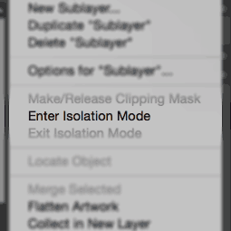

When designing UIs, I make copious use of [Illustrator’s](http://www.adobe.com/products/illustrator.html) layers. I love the flexibility of designing parts of an interface separately, then toggling them on and off to see how various parts fit together.

Having dozens of layers is great when you’re putting the finishing touches on a design or figuring out what pieces fit best together, but it can be a pain sorting through everything in the [Layers panel](https://helpx.adobe.com/illustrator/using/layers.html#layers_panel_overview) until then. Keeping a mental note of where all your objects and groups are located—not to mention navigating the sea of [norgies](http://www.urbandictionary.com/define.php?term=norgie)—can be a nightmare. Fortunately, Illustrator has the perfect feature that can help.

## Introducing Isolation Mode

You may be familiar with Isolation Mode if you use [symbols](https://helpx.adobe.com/illustrator/using/symbols.html) in Illustrator: double-clicking a placed symbol enters a mode where changes you make apply only to the symbol, and not the rest of the document. In fact, the Layers panel only shows the symbol’s objects, so there’s no chance you’ll accidentally select some external object.

Fortunately, you can also enter Isolation Mode on other things (including layers, groups, and even single _objects_), as well! To start, select a layer in the Layers panel (you just need to select the layer, not “target” it), then click the panel’s “menu” icon and choose “Enter Isolation Mode”.

## Working in Isolation

After entering Isolation Mode, you’ll notice a couple of changes to the Illustrator UI. First, the Layers Panel updates to only show the layer you’re working with. Second, everything _not_ in the isolated layer will fade out, allowing you to visually focus on the layer you’ve selected. Finally, a new bar appears below the active tab (or below its rulers, if you have those enabled) that shows the hierarchy of this layer:

Now that you’re in Isolation Mode, any new objects you create will become part of the isolated layer, and you won’t be able to select anything outside that layer (that part alone is my favorite part of this feature).

To leave Isolation Mode, you have a couple of options. If you’re in a deeply-nested layer, you can click the name of an ancestor layer in the Isolation Mode bar to switch to Isolation Mode for that layer. Alternatively, just double-click an empty part of the document window to exit Isolation Mode entirely.

I hope you find Illustrator’s Isolation Mode feature as invaluable as I do when working with complex documents. Have any layer productivity tips of your own? Share them in the comments!
