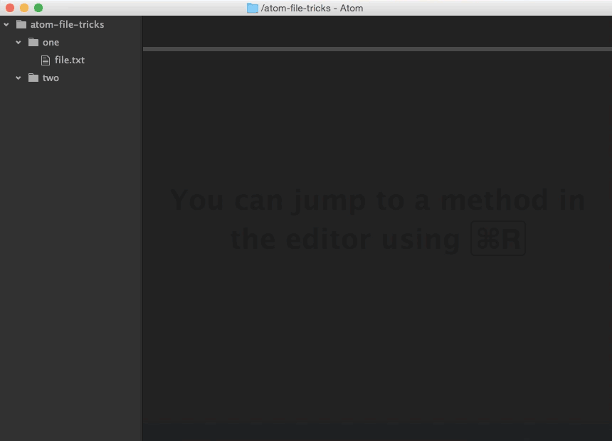

I’m a huge fan of [Atom](https://atom.io/), [GitHub](https://github.com/)’s [open source](https://github.com/atom/atom) text editor. The more time I can spend in it (instead of switching contexts between different applications), the better. In this post, I’d like to share with you a few simple file operations you can perform inside Atom instead of ⌘+Tab-ing elsewhere:

## Moving Files

You may have used Atom’s “rename” feature a time or two, but did you know you can also use it to move files, as well? When you open the “rename” palette, Atom displays the file’s full path (relative to the project root). Want to relocate the file? Simply change the path and hit return:

## Copying/Pasting Files

The next time you need to copy and paste a file, why not use Atom instead of your OS’s file explorer? Right-click a file, select “Duplicate”, and Atom prompts you for the file’s new name. Much like moving a file, just change the path to wherever you’d like to copy the new file, hit return, and presto!

## Creating New Files

Sure, new files are only a couple of mouse clicks away, but why should you even have to take your hands off your keyboard? Spoiler alert: you don’t have to! Atom includes a command to do just that, but it’s not bound to a keyboard shortcut…yet. Here’s how to make that happen:

1. Open your Atom keymap (Mac: “Atom” > “Open Your Keymap”; Windows: “File” > “Open Your Keymap”).
2. Add the following text, replacing the keystroke with one of your preference (I took mine from a [Sublime plugin](https://github.com/skuroda/Sublime-AdvancedNewFile)):'body':
  'cmd-alt-n': 'tree-view:add-file'
3. Save your keymap file.

Now, just hit ⌥⌘N (or whatever you specified your shortcut to be) and Atom presents you with the “new file” palette. Enter a path for the new file (again, relative to the project root) and hit return/enter. Your shiny new file will present itself instantly.

Have you used Atom’s features to do things otherwise thought the domain of other apps? Share them in the comments!
