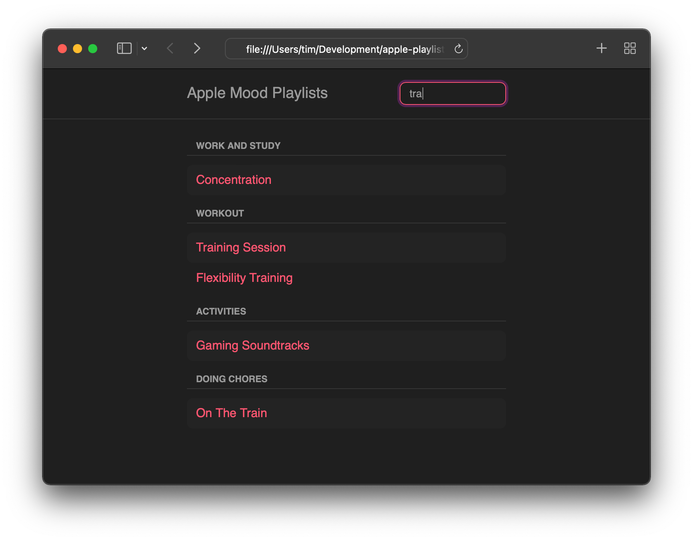

## Posts in This Series

<dl>
  <dt><a href="/2021/12/advanced-alpine-js-part-1/">Part I: The Story So Far</a></dt>
  <dd>In which we review some basics about Alpine.js</dd>
  <dt>Part II: Moving Beyond HTML (This post)</dt>
  <dd>In which we refactor our app and add filtering</dd>
  <dt>Part III</dt>
  <dd>Coming soon!</dd>
  <dt>Part IV</dt>
  <dd>Coming soon!</dd>
  <dt>Part V</dt>
  <dd>Coming soon!</dd>
</dl>

In this series, we've been building a music playlist app using some modern workflows and Alpine.js features. Today, we'll add a quality-of-life improvement for our users and get to know some of Alpine's more advanced features. We'll start by moving and refactoring our inline code into a separate JavaScript file, then add filtering so users can more easily navigate through the 250+ playlists. Let's get started!

## Moving Beyond HTML

Up to this point, we've used Alpine's expressive inline code directives for all the behavior in our app. Though this is a perfectly fine way to continue, reading JavaScript _inside_ HTML attributes gets more and more difficult over time. If you're working with Alpine's inline scripts in production, I'd encourage you to frequently revisit whether it's time to move to a more formal script file. For our playlists app, now is that time!

Alpine provides a convenient global for injecting our formerly-inline scripts into its runtime, as well as a global `document` event so we can ensure it's completely loaded before attempting to do so:

```js
document.addEventListener('alpine:init', () => {
  // We have access to `window.Alpine` here to add our logic
})
```

At this point, though, we have a choice of how to proceed: Continuing to use a [`data`][alpine-data] object, or upgrading to a [`store`][alpine-store]. These two concepts are fairly similar, and use nearly-identical APIs, supporting properties, functions, etc. The main difference is that Stores are globally-accessible in Alpine apps (via the [`$store`][alpine-store-magic] variable), while Data objects are designed to be more tightly-scoped and flexible.

Our straightforward app could quite easily rely on either approach, but we'll take this opportunity to add a Store. In your apps, this is a great opportunity to think about whether you need to reuse these services, and how much of your app they affect. Logic included in specific parts of your app (think widgets, cards, and the like) are well-served by Data objects, while tracking global state like a user's authentication status and preferences work well with Stores.

Okay, back to some code! After creating our new script file, let's create a Store and add some basic functionality. In part one, we used [Lodash][lodash] and a `window` global to group our playlists by a given property. We could continue to use Lodash's response format (a single object with one key per group), but I think a proper array is more understandable, so we'll dip into the native [`Object.entries()`][object-entries] function to clean that up, as well:

```js
document.addEventListener('alpine:init', () => {
  // Note the Store's name of "app", which we'll reference in the HTML.
  Alpine.store('app', {
    get groupedPlaylists() {
      return Object
        .entries(_.groupBy(window.data, 'group'))
        .map(([ groupName, playlists ]) => ({
          groupName, playlists
        }))
    },
  })
})
```

We also need to update the HTML directives to reference our nascent Store. Our wrapper `<template>` tag now looks like this:

```html
<!-- `$store.app` is how we reference our Store by name. -->
<template
  x-for="group of $store.app.groupedPlaylists"
  :key="group.groupName"
>
  <!--
    References to `groupName` and `playlists` need to be updated to
    use `group.`, as well.
  -->
</template>
```

Hopefully you can already see the benefits of a separate script file: Putting our multi-step conversion from an object literal into an array of objects would be quite confusing to try to read in the middle of an HTML attribute, and that's even assuming syntax highlighting works!

Now that we have a great place for more complex logic, let's add some!

[alpine-data]: https://alpinejs.dev/globals/alpine-data
[alpine-store]: https://alpinejs.dev/globals/alpine-store
[alpine-store-magic]: https://alpinejs.dev/magics/store
[lodash]: https://lodash.com
[object-entries]: https://developer.mozilla.org/en-US/docs/Web/JavaScript/Reference/Global_Objects/Object/entries

## Our Feature Presentation

The first feature we're going to add to our app is filtering. Our playlists collection comprises over 250 items, which is a lot to scroll through! Adding a quick filter would really help our users narrow down the potential mood playlists they can listen to. The Alpine docs already contain [a tutorial on building a search input][alpine-tutorial], so I won't go into too much detail on how to build one, but the code is quite clear, regardless.

There are two behaviors I'd like to highlight, however: One, we'd still like our playlists grouped after they're filtered, so we're going to update the `groupedPlaylists` property to group the _filtered_ list instead of the complete one; and two, since we're using each playlist's `slug`, we need to replace any hyphens with blank spaces in case a user searches a string like "chilling out". The latter is easily accomplished with a regular expression.

```js
Alpine.store('app', {
  filter: '', // This property will be bound to an HTML <input>
  get filteredPlaylists() {
    let filterString = this.filter.toLowerCase().trim()

    // If the user hasn't entered text, return all playlists
    if (filterString === '') return window.data

    // Otherwise, perform the basic "search" by playlist name
    return window.data.filter((playlist) => {
      let playlistName = playlist.slug.replace(/-/g, ' ')
      return playlistName.includes(filterString)
    })
  },
  get groupedPlaylists() {
    // This property remains mostly the same, but we'll replace
    // `window.data` with `this.filteredPlaylists`.
  },
})
```

As you might expect with a modern JavaScript library, Alpine handles all the [reactivity][alpine-reactivity] for us! Just referencing `this.filter` and friends automatically re-evaluates each property whenever the upstream values change.

At this point, we could play around with the `filter` property to make sure the searching works, but it's so easy to add the `<input>` so users can perform the filter that we may as well! We'll add the search filter input into the page's `<header>`; if you've been following along with the HTML, you'll know that only our `<ul>` is "Alpine-aware" via a `x-data` attribute, so we can either add `x-data` to the header element, or the HTML `<body>` itself. I've chosen the latter, since this entire page now is one big app!

```html
<body x-data>
  <header role="banner">
    <div class="constrained">
      <h1>Apple Mood Playlists</h1>
      <!-- Note the `$store.app` prefix is here, as well. -->
      <input x-model="$store.app.filter" placeholder="Search">
    </div>
  </header>
  <!-- ... -->
</body>
```

We now have a nice quick filter input that searches playlist names, and thanks to our updates to the `groupedPlaylist` property, we don't even have to deal with empty groups! If you're feeling adventurous, though, a great UX improvement would be to display a "no results" message, but I'll leave that as an exercise to the reader.



## Until Next Time!

In this post, we refactored Alpine's inline HTML directives into a separate script file, and added a quick filter so users can easily find playlists. Filtering is a great start to improving our app's user experience, but we can go further: Allowing users to "favorite" mood playlists is a fantastic way to make our app even more usable! Stop by in our next post when we do just that, and we'll look at another nifty component of Alpine while we're at it. Happy listening!

[alpine-tutorial]: https://alpinejs.dev/start-here#building-a-search-input
[alpine-reactivity]: https://alpinejs.dev/advanced/reactivity

### Resources in this post

* [Source code for Part II (GitHub)][github]

[github]: https://github.com/timgthomas/apple-playlists/tree/main/blog/part-2
