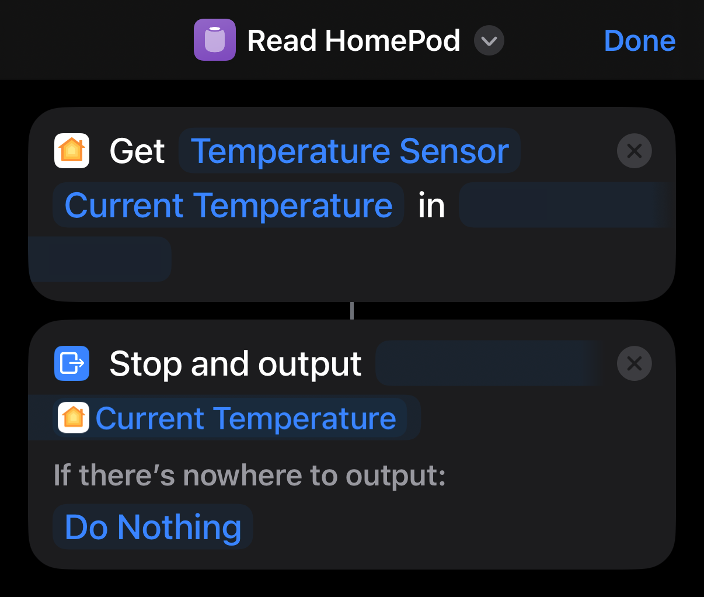

When my HomePods aren't serenading my office with [the Chill playlist](https://music.apple.com/us/station/apple-music-chill/ra.1740614260), keeping me blissfully asleep with nature sounds at night, or fielding my endless Siri queries, they're also subtly monitoring the environment: Modern HomePod models [include both temperature and humidity sensors](https://support.apple.com/en-us/108045#163), but their values (and thus value) have been constrained to the HomeKit walled garden…but not for long!

Keen-eyed HomeKit users have likely seen these sensors in their Home apps, but we can extract this data for our own automation purposes…fairly easily, as it turns out! In this post, we'll unlock access to these sensors via the Shortcuts app and some CLI magic. Stay tuned!

## Shortcut to Success

Apple's [Shortcuts app](https://support.apple.com/guide/shortcuts/welcome/ios) is a surprisingly powerful tool for automation, but it’s also a bridge between Apple’s oft-locked-down ecosystem and some of our own custom workflows. Let's create a simple Shortcut that reads a HomePod's temperature:



We need but two Shortcut actions here:
* **Get State**. This node will read the value of our HomePod sensor, which you'll see exposed as "Temperature Sensor" unless you've renamed it (which isn't a bad idea!).
* **Stop and Output**. This node does exactly as described: It halts execution of the Shortcut and outputs a given value…here, the temperature! More on this later.

Save the Shortcut and make note of its name, as we'll use that next!

## It's Terminal Time!

The magic happens when we step outside the Shortcuts app and into the CLI: Shortcuts provides a [conveniently-named `shortcuts` command](https://support.apple.com/en-gb/guide/shortcuts-mac/apd455c82f02/mac) to execute a Shortcut via its name.

```bash
shortcuts run "Read HomePod"
```

Running the command now, however, produces…not much. The "Stop and Output" action is really designed for running a Shortcut interactively, and `shortcuts run` prefers a file as output, which doesn't do our automations any good; however, a [helpful Redditor came up with a nifty workaround](https://www.reddit.com/r/shortcuts/comments/nw4bqe/comment/j13hg6s)!

The Unix `tee` utility takes its input from `STDIN` and writes it simultaneously to `STDOUT` and a file. Serendipitously, piping the output of `shortcuts run` to `tee` makes our output visible!

```bash
$ shortcuts run "Read HomePod" | tee

  20.8°C
```

From here, our options are endless! Aside from the obvious geeky satisfaction, programmatically reading data from your HomePods—or any of your HomeKit accessories, for that matter!—can open all kinds of doors. Personally, I have a service that vends these values for my homelab's dashboard…but that's another post! Until then, share your favorite Shortcuts and HomeKit hacks in the comments…and happy hacking!
